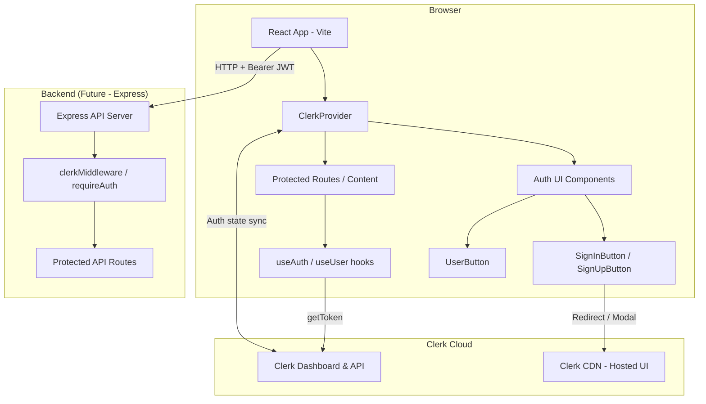
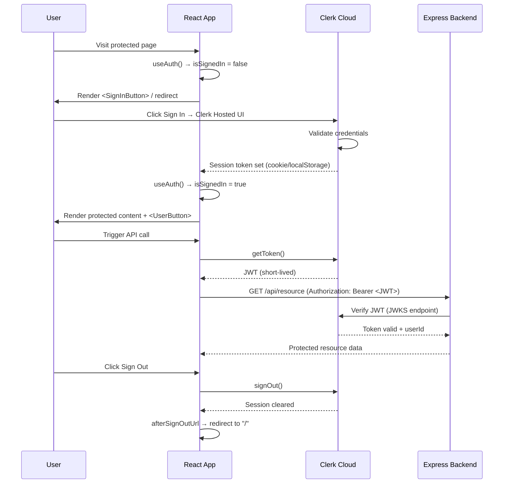
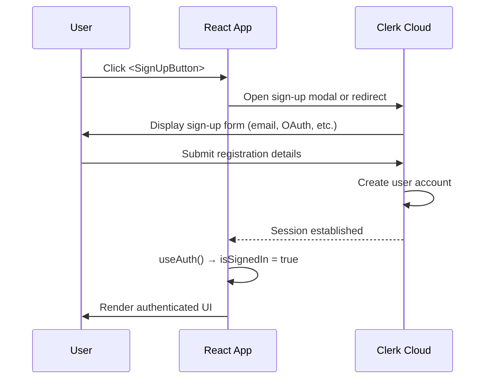

# Design Document: Clerk Authentication Integration

## Overview

This document describes the integration of [Clerk](https://clerk.com) authentication into the existing React + TypeScript + Vite frontend application. Clerk provides a fully managed authentication and user management solution, replacing the need to build auth flows from scratch. The integration covers the frontend React app (`Frontend/Frontend`) and establishes the contract for a future Express backend (`Backend/`) that will validate Clerk-issued JWTs on protected API routes.

The design covers both the high-level architecture (how Clerk fits into the overall system) and the low-level implementation details (specific components, hooks, environment configuration, and code structure).

## Architecture

### System Overview



### Authentication Flow



### Sign-Up Flow



---

## Components and Interfaces

### Component 1: `ClerkProvider` (Root Wrapper)

**Purpose**: Provides Clerk authentication context to the entire React component tree. Must wrap the root of the application.

**Location**: `Frontend/Frontend/src/main.tsx`

**Interface**:
```typescript
interface ClerkProviderProps {
  publishableKey: string       // VITE_CLERK_PUBLISHABLE_KEY from env
  afterSignOutUrl: string      // URL to redirect after sign-out (e.g., "/")
  children: React.ReactNode
}
```

**Responsibilities**:
- Initialize Clerk SDK with the publishable key
- Manage session state and sync with Clerk Cloud
- Provide auth context to all child components via React Context
- Handle token refresh automatically

---

### Component 2: `Header` (Navigation with Auth Controls)

**Purpose**: Top-level navigation bar that conditionally renders auth buttons or the user avatar based on sign-in state.

**Location**: `Frontend/Frontend/src/components/Header.tsx` *(new file)*

**Interface**:
```typescript
interface HeaderProps {
  // No required props — reads auth state from Clerk context internally
}
```

**Responsibilities**:
- Render `<SignInButton>` and `<SignUpButton>` when user is signed out
- Render `<UserButton>` when user is signed in
- Use `<SignedIn>` / `<SignedOut>` control-flow components for conditional rendering

---

### Component 3: `ProtectedContent`

**Purpose**: Wraps any content that should only be visible to authenticated users.

**Location**: `Frontend/Frontend/src/components/ProtectedContent.tsx` *(new file)*

**Interface**:
```typescript
interface ProtectedContentProps {
  children: React.ReactNode
  fallback?: React.ReactNode  // Optional: what to show when signed out
}
```

**Responsibilities**:
- Use `<SignedIn>` to gate content behind authentication
- Optionally render a fallback (e.g., a sign-in prompt) via `<SignedOut>`

---

### Component 4: `App` (Updated Root Component)

**Purpose**: Application shell that composes the Header and main content area.

**Location**: `Frontend/Frontend/src/App.tsx` *(modified)*

**Responsibilities**:
- Render `<Header>` at the top of the layout
- Render main content sections
- Delegate auth state rendering to Clerk components

---

## Data Models

### Clerk `UserResource` (from `@clerk/react`)

The primary user object returned by `useUser()`:

```typescript
interface UserResource {
  id: string                          // Clerk user ID (e.g., "user_2abc...")
  firstName: string | null
  lastName: string | null
  fullName: string | null
  username: string | null
  primaryEmailAddress: EmailAddressResource | null
  primaryPhoneNumber: PhoneNumberResource | null
  imageUrl: string                    // Avatar URL
  publicMetadata: Record<string, unknown>
  createdAt: Date | null
  updatedAt: Date | null
}
```

### Clerk `AuthObject` (from `useAuth()`)

```typescript
interface AuthObject {
  isLoaded: boolean         // false during initial SDK load
  isSignedIn: boolean       // true when a valid session exists
  userId: string | null     // Clerk user ID when signed in
  sessionId: string | null  // Current session ID
  getToken: (options?: GetTokenOptions) => Promise<string | null>
  signOut: (options?: SignOutOptions) => Promise<void>
}
```

### Environment Configuration

```typescript
// Accessed via import.meta.env in Vite
interface ViteEnv {
  VITE_CLERK_PUBLISHABLE_KEY: string  // Required: pk_test_... or pk_live_...
}
```

**Validation Rules**:
- `VITE_CLERK_PUBLISHABLE_KEY` must be present at build time; app should throw a descriptive error if missing
- Key format: starts with `pk_test_` (development) or `pk_live_` (production)

### JWT Payload (for Backend Validation)

```typescript
// Decoded Clerk JWT — validated by Express backend
interface ClerkJWTPayload {
  sub: string           // Clerk user ID
  sid: string           // Session ID
  iss: string           // Issuer: "https://<your-clerk-domain>"
  aud: string           // Audience
  iat: number           // Issued at (Unix timestamp)
  exp: number           // Expiration (Unix timestamp)
  azp?: string          // Authorized party (client origin)
}
```

---

## Key Functions with Formal Specifications

### Function 1: `getPublishableKey()`

```typescript
function getPublishableKey(): string
```

**Preconditions**:
- `import.meta.env.VITE_CLERK_PUBLISHABLE_KEY` is defined in `.env.local`

**Postconditions**:
- Returns the publishable key string if defined
- Throws `Error("Missing VITE_CLERK_PUBLISHABLE_KEY")` if undefined or empty
- Never returns an empty string

---

### Function 2: `useAuthGuard()`

```typescript
function useAuthGuard(): { isLoaded: boolean; isSignedIn: boolean; userId: string | null }
```

**Preconditions**:
- Must be called inside a component that is a descendant of `<ClerkProvider>`

**Postconditions**:
- Returns `{ isLoaded: false, isSignedIn: false, userId: null }` during initial SDK load
- Returns `{ isLoaded: true, isSignedIn: true, userId: string }` when session is active
- Returns `{ isLoaded: true, isSignedIn: false, userId: null }` when no session exists
- `userId` is non-null if and only if `isSignedIn` is `true`

---

### Function 3: `getApiToken()`

```typescript
async function getApiToken(): Promise<string>
```

**Preconditions**:
- User is signed in (`isSignedIn === true`)
- `getToken` from `useAuth()` is available

**Postconditions**:
- Returns a valid, short-lived JWT string
- Throws if user is not signed in or token fetch fails
- Token is suitable for use as `Authorization: Bearer <token>` header

---

## Algorithmic Pseudocode

### Main Initialization Algorithm

```typescript
// main.tsx — Application bootstrap with Clerk
function bootstrapApp(): void {
  const publishableKey = import.meta.env.VITE_CLERK_PUBLISHABLE_KEY

  if (!publishableKey) {
    throw new Error(
      "Missing VITE_CLERK_PUBLISHABLE_KEY. " +
      "Add it to Frontend/Frontend/.env.local"
    )
  }

  const rootElement = document.getElementById("root")
  if (!rootElement) throw new Error("Root element not found")

  createRoot(rootElement).render(
    <StrictMode>
      <ClerkProvider
        publishableKey={publishableKey}
        afterSignOutUrl="/"
      >
        <App />
      </ClerkProvider>
    </StrictMode>
  )
}
```

**Preconditions**:
- `VITE_CLERK_PUBLISHABLE_KEY` is set in `.env.local`
- DOM element with `id="root"` exists in `index.html`

**Postconditions**:
- React app is mounted with Clerk context available to all descendants
- If key is missing, a descriptive error is thrown before render

---

### Conditional Auth Rendering Algorithm

```typescript
// Header.tsx — Conditional rendering based on auth state
function Header(): JSX.Element {
  return (
    <header>
      <nav>
        <span>My App</span>
        <div className="auth-controls">
          {/* SignedOut: shown only when user is NOT authenticated */}
          <SignedOut>
            <SignInButton mode="modal" />
            <SignUpButton mode="modal" />
          </SignedOut>

          {/* SignedIn: shown only when user IS authenticated */}
          <SignedIn>
            <UserButton afterSignOutUrl="/" />
          </SignedIn>
        </div>
      </nav>
    </header>
  )
}
```

**Preconditions**:
- Component is rendered inside `<ClerkProvider>`
- Clerk SDK has loaded (`isLoaded` transitions to `true` automatically)

**Postconditions**:
- Exactly one of `<SignedOut>` or `<SignedIn>` content is visible at any time
- `<UserButton>` provides sign-out, profile management, and account switching

---

### Protected Content Gating Algorithm

```typescript
// ProtectedContent.tsx
function ProtectedContent({
  children,
  fallback = <p>Please sign in to view this content.</p>
}: ProtectedContentProps): JSX.Element {
  return (
    <>
      <SignedIn>{children}</SignedIn>
      <SignedOut>{fallback}</SignedOut>
    </>
  )
}
```

**Preconditions**:
- Component is rendered inside `<ClerkProvider>`

**Postconditions**:
- `children` renders if and only if `isSignedIn === true`
- `fallback` renders if and only if `isSignedIn === false`
- No content flicker after initial load (Clerk handles loading state internally)

---

### API Call with JWT Algorithm

```typescript
// Example: authenticated fetch utility
async function fetchWithAuth(
  url: string,
  getToken: () => Promise<string | null>,
  options: RequestInit = {}
): Promise<Response> {
  const token = await getToken()

  if (!token) {
    throw new Error("No auth token available — user may not be signed in")
  }

  return fetch(url, {
    ...options,
    headers: {
      ...options.headers,
      "Authorization": `Bearer ${token}`,
      "Content-Type": "application/json",
    },
  })
}
```

**Preconditions**:
- `getToken` is the function from `useAuth()` hook
- User is signed in

**Postconditions**:
- Returns a `Response` with the `Authorization` header set
- Throws descriptively if token is unavailable

**Loop Invariants**: N/A (no loops)

---

### Backend JWT Verification Algorithm (Future Express)

```typescript
// Backend/src/middleware/clerkAuth.ts (future implementation)
// Uses @clerk/express package

import { clerkMiddleware, requireAuth } from "@clerk/express"

// Step 1: Initialize Clerk middleware (reads CLERK_SECRET_KEY from env)
app.use(clerkMiddleware())

// Step 2: Protect individual routes
app.get("/api/protected", requireAuth(), (req, res) => {
  const { userId } = req.auth  // Clerk injects auth object
  res.json({ message: `Hello, user ${userId}` })
})
```

**Preconditions**:
- `CLERK_SECRET_KEY` is set in backend `.env`
- `Authorization: Bearer <JWT>` header is present on the request

**Postconditions**:
- `req.auth.userId` is populated with the verified Clerk user ID
- Returns `401 Unauthorized` if token is missing, expired, or invalid
- Returns `403 Forbidden` if token is valid but user lacks required permissions

---

## Example Usage

### 1. Environment Setup

```bash
# Frontend/Frontend/.env.local
VITE_CLERK_PUBLISHABLE_KEY=pk_test_your_key_here
```

### 2. Updated `main.tsx`

```typescript
import { StrictMode } from 'react'
import { createRoot } from 'react-dom/client'
import { ClerkProvider } from '@clerk/react'
import './index.css'
import App from './App.tsx'

const publishableKey = import.meta.env.VITE_CLERK_PUBLISHABLE_KEY

if (!publishableKey) {
  throw new Error("Missing VITE_CLERK_PUBLISHABLE_KEY in .env.local")
}

createRoot(document.getElementById('root')!).render(
  <StrictMode>
    <ClerkProvider
      publishableKey={publishableKey}
      afterSignOutUrl="/"
    >
      <App />
    </ClerkProvider>
  </StrictMode>,
)
```

### 3. `Header.tsx` Component

```typescript
import {
  SignedIn,
  SignedOut,
  SignInButton,
  SignUpButton,
  UserButton,
} from '@clerk/react'

export function Header() {
  return (
    <header className="app-header">
      <nav>
        <span className="app-title">My App</span>
        <div className="auth-controls">
          <SignedOut>
            <SignInButton mode="modal" />
            <SignUpButton mode="modal" />
          </SignedOut>
          <SignedIn>
            <UserButton afterSignOutUrl="/" />
          </SignedIn>
        </div>
      </nav>
    </header>
  )
}
```

### 4. Using `useUser()` to Display User Info

```typescript
import { useUser } from '@clerk/react'

export function WelcomeBanner() {
  const { isLoaded, isSignedIn, user } = useUser()

  if (!isLoaded) return <p>Loading...</p>
  if (!isSignedIn) return null

  return (
    <p>Welcome back, {user.firstName ?? user.primaryEmailAddress?.emailAddress}!</p>
  )
}
```

### 5. Making Authenticated API Calls

```typescript
import { useAuth } from '@clerk/react'

export function DataFetcher() {
  const { getToken } = useAuth()

  async function loadData() {
    const token = await getToken()
    const response = await fetch('/api/data', {
      headers: { Authorization: `Bearer ${token}` },
    })
    return response.json()
  }

  // ... render logic
}
```

---

## Correctness Properties

1. **Key presence**: For all application renders, if `VITE_CLERK_PUBLISHABLE_KEY` is undefined, the app throws before mounting — no unauthenticated render occurs with a missing key.

2. **Auth exclusivity**: For all states, `<SignedIn>` content and `<SignedOut>` content are mutually exclusive — never both visible simultaneously.

3. **userId consistency**: For all auth states, `userId !== null` if and only if `isSignedIn === true`.

4. **Token validity**: For all API calls using `getToken()`, the returned JWT is non-null if and only if the user is currently signed in.

5. **afterSignOutUrl**: For all sign-out events, the user is redirected to `"/"` — never left on a page that requires authentication.

6. **Provider scope**: For all Clerk hook calls (`useAuth`, `useUser`, `useClerk`), the calling component must be a descendant of `<ClerkProvider>` — otherwise Clerk throws a descriptive error.

---

## Error Handling

### Error Scenario 1: Missing Publishable Key

**Condition**: `VITE_CLERK_PUBLISHABLE_KEY` is not set in `.env.local`
**Response**: Throw `Error("Missing VITE_CLERK_PUBLISHABLE_KEY in .env.local")` before `createRoot` is called
**Recovery**: Developer adds the key to `.env.local` and restarts the dev server

### Error Scenario 2: Clerk SDK Load Failure

**Condition**: Network error prevents Clerk JS from loading
**Response**: `isLoaded` remains `false`; auth UI components do not render
**Recovery**: Display a loading spinner or skeleton UI while `!isLoaded`; retry on reconnect

### Error Scenario 3: Expired Session

**Condition**: User's session token has expired
**Response**: Clerk automatically attempts silent token refresh; if refresh fails, `isSignedIn` becomes `false`
**Recovery**: `<SignedOut>` content renders automatically, prompting re-authentication

### Error Scenario 4: Invalid JWT on Backend

**Condition**: Frontend sends an expired or tampered JWT to the Express API
**Response**: `requireAuth()` middleware returns `401 Unauthorized`
**Recovery**: Frontend catches the 401, calls `getToken()` to refresh, and retries the request once

### Error Scenario 5: User Cancels Sign-In

**Condition**: User opens the sign-in modal and closes it without completing
**Response**: Modal closes; `isSignedIn` remains `false`; no error state
**Recovery**: No recovery needed — user remains on the current page in signed-out state

---

## Testing Strategy

### Unit Testing Approach

Test individual components in isolation using `@clerk/react`'s mock utilities:

```typescript
import { render, screen } from '@testing-library/react'
import { ClerkProvider } from '@clerk/react'

// Use Clerk's test helpers to mock auth state
import { mockSignedIn, mockSignedOut } from '@clerk/testing/vitest'

test('Header shows UserButton when signed in', () => {
  mockSignedIn({ userId: 'user_123' })
  render(<Header />, { wrapper: ClerkProvider })
  expect(screen.getByRole('button', { name: /user/i })).toBeInTheDocument()
})

test('Header shows SignInButton when signed out', () => {
  mockSignedOut()
  render(<Header />, { wrapper: ClerkProvider })
  expect(screen.getByText(/sign in/i)).toBeInTheDocument()
})
```

### Property-Based Testing Approach

**Property Test Library**: `fast-check`

Key properties to verify:

```typescript
import fc from 'fast-check'

// Property: getPublishableKey always throws for falsy values
fc.assert(
  fc.property(
    fc.oneof(fc.constant(''), fc.constant(undefined), fc.constant(null)),
    (key) => {
      expect(() => getPublishableKey(key)).toThrow()
    }
  )
)

// Property: fetchWithAuth always includes Authorization header
fc.assert(
  fc.property(
    fc.string({ minLength: 10 }),  // arbitrary JWT string
    async (token) => {
      const mockGetToken = async () => token
      const response = await fetchWithAuth('/api/test', mockGetToken)
      // Verify header was set (via mock fetch)
    }
  )
)
```

### Integration Testing Approach

- Use Playwright or Cypress with Clerk's E2E testing helpers (`@clerk/testing`)
- Test the full sign-in → protected content → sign-out flow against a Clerk test environment
- Verify that API calls from the frontend include valid JWTs that the backend accepts

---

## Performance Considerations

- **Lazy loading**: Clerk's JS bundle is loaded asynchronously; the `isLoaded` flag prevents rendering auth-dependent UI before the SDK is ready, avoiding layout shifts.
- **Token caching**: `getToken()` returns a cached token when valid; it only makes a network request when the token is near expiry. Avoid calling `getToken()` in render loops.
- **Modal vs. redirect**: Using `mode="modal"` for `<SignInButton>` and `<SignUpButton>` keeps the user on the current page, avoiding full page reloads and improving perceived performance.
- **Bundle size**: `@clerk/react` is tree-shakeable. Only import the components and hooks you use.

---

## Security Considerations

- **Never expose `CLERK_SECRET_KEY`** in the frontend. It belongs only in the backend `.env` file and must never be committed to source control.
- **`VITE_CLERK_PUBLISHABLE_KEY`** is safe to expose in the frontend (it's designed to be public), but should still be kept out of source control via `.env.local` (which is `.gitignore`d by Vite by default).
- **JWT validation** must happen server-side. The frontend should never trust its own auth state for access control decisions — always validate the JWT on the backend.
- **`afterSignOutUrl`** should point to a public route (`"/"`) to prevent post-logout redirects to protected pages.
- **HTTPS only**: Clerk sessions use secure, `HttpOnly` cookies in production. Ensure the app is served over HTTPS in production environments.
- **CORS**: The Express backend must configure CORS to only accept requests from the known frontend origin.

---

## Dependencies

### Frontend

| Package | Version | Purpose |
|---|---|---|
| `@clerk/react` | `latest` | Clerk React SDK — `ClerkProvider`, hooks, UI components |

Install:
```bash
npm install @clerk/react@latest
```

### Backend (Future)

| Package | Version | Purpose |
|---|---|---|
| `@clerk/express` | `latest` | Clerk Express middleware — `clerkMiddleware`, `requireAuth` |
| `@clerk/backend` | `latest` | Backend utilities for manual JWT verification if needed |

### Environment Files

| File | Location | Committed? |
|---|---|---|
| `.env.local` | `Frontend/Frontend/.env.local` | No (`.gitignore`d) |
| `.env` | `Backend/.env` | No (`.gitignore`d) |

### External Services

- **Clerk Dashboard**: [https://dashboard.clerk.com](https://dashboard.clerk.com) — create an application to obtain API keys
- **Clerk JWKS Endpoint**: `https://<your-clerk-domain>/.well-known/jwks.json` — used by the backend to verify JWTs
